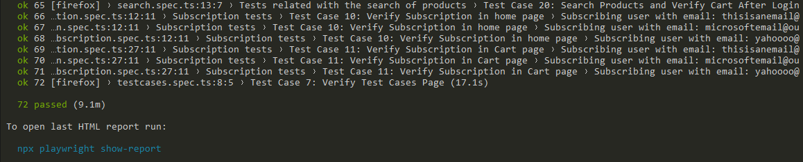

# Automation testing exercise

This is a personal project to improve my understanding of Playwright tools. I'll cover how it works and everything I learned during this project.


- [Introduction](#introduction-heading)
- [Demonstration](#second-heading)
- [Requirements](#third-heading)
- [Instructions](#forth-heading)
- [What I learned](#fifth-heading)
 
<a id="introduction-heading"></a>
# Introduction

Based on the excercise of the following website https://automationexercise.com/ I built a test suite to assure its quality and learn about Playwright. 

You can find every pre-built test case provided by the web in https://automationexercise.com/test_cases.

Inside the repository, you can find all the tests inside the "/tests" folder. They are divided according each tested sections of the website.

<a id="second-heading"></a>
# Demonstration




Incluye capturas de pantalla o gifs animados que muestren ejemplos de tus pruebas en acción. Puedes utilizar imágenes o videos para hacerlo más dinámico e interesante. También podrías proporcionar enlaces a un sitio web o plataforma de alojamiento de videos donde los usuarios puedan ver tus pruebas en funcionamiento.

<a id="third-heading"></a>
# Requirements

To execute the tests you need to have [Node.js](https://nodejs.org/es) installed on your machine.

Then install Playwright
```
npx playwright install
```

Once you have Node.js and Playwright installed, clone or download this repository and you're ready to go.

```
git clone https://github.com/Fede2797/automation-exercise-playwright.git 
```

<a id="forth-heading"></a>
# Instructions

Before running any tests, it is necessary to install the project's dependencies. 

To do so open your terminal, head down to the project's directory and run:

```
npm install
```

### Then, you can run every test with simple commands:

This instruction runs every test of the project in headless mode
```
npx playwright test tests/
```

This instruction runs every test of the project headed
```
npx playwright test tests/ --headed
```

Or you can choose to run a single file like this:
```
npx playwright test tests/cart.spec.ts
```

<a id="fifth-heading"></a>
# What I learned

### Data Driven Testing
I decided to try out this method in our authentication testing. Basically, I put together sets of different input data for the sign-up and sign-in test scripts. Then, I created scripts that could use this data and run each test case separately, taking full advantage of Playwright's ability to run tests in parallel. 


### Ad handling
The ad handling part was quite challenging. This website displays various types of ads in each section, which required me to create a script capable of recognizing which ad appeared at any given moment and taking the necessary action to manage it. 


Usually, websites use iframes to embed HTML documents within the current site to display ads, and Playwright has this really useful tool to access the view from iframes inside the website "frameLocator".

### Upload files
Playwright has a very straight forward way to upload images. With just one line of code I was able to upload an image.


### HTML Reports and Trace Viewer
A la hora de detectar los errores (tanto al desarrollar los tests como al ejecutar las pruebas) el uso de los reportes HTML nos brinda una ayuda esencial. 
En caso de fallar alguno de los tests, se registra el motivo del fallo y la línea de código que no pudo ser ejecutada o la condición que no fue cumplida.


Otra herramienta muy útil es el Trace Viewer. Esta herramienta nos permite explorar los traces generados por Playwright después de ejecutar el script. Es esencialmente útil para detectar si es que existe algún pop-up, ad o cualquier elemento que bloquee el acceso al elemento que queremos localizar.


